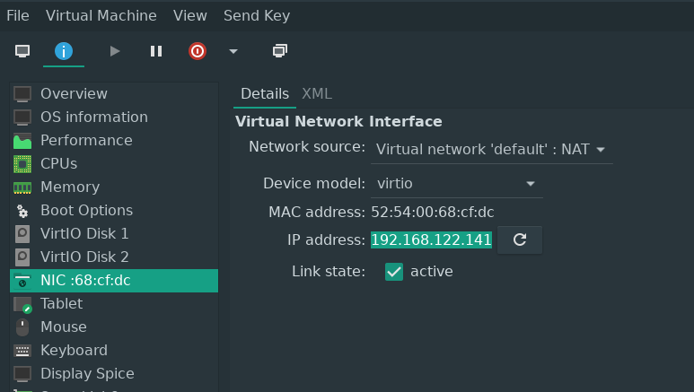

# Virtual PC in Linux

There are multiple options for virtualization in Linux. One of the most popular is [VirtualBox](https://www.virtualbox.org/) which is developed by Oracle.

VirtualBox is a powerful and popular tool but it doesn't mean that is the best one. The biggest disadvantage in VirtualBox for Linux is that it does not use [KVM](https://wiki.archlinux.org/index.php/KVM) that is built into the kernel and work way faster than the original VirtualBox emulation engine.

## Virtual Machine Manger

The virt-manager is an alternative to VirtualBox that is based on Linux-native virtualization tools, such is [KVM](https://wiki.archlinux.org/index.php/KVM) and [QEMU](https://wiki.archlinux.org/index.php/QEMU) so it is much more fast and lightweight.

### Installation

On an Arch-based Linux *virt-manager* can be installed from the official repositories using *pacman*: 

    $ sudo pacman -S qemu ebtables virt-manager

After the installation you'll be able to run the *libvirtd* daemon:

    $ sudo systemctl enable libvirtd
    $ sudo systemctl start libvirtd

It is also recommended to add current user into *libvirtd* group:

    $ sudo usermod -G libvirtd -a USERNAME

## SSH into a virtual machine from the host

In order to be able to connect to a virtual machine using SSH first you have to [install SSH server](ssh.md#install) into the VM and run it.

When SSH server is installed and running you have to get the IP address. You can get the address into the VM by executing [ip address](ip.md) or you can open the virtual machine **info** tab and find the address at the virtual network interface profile:

## VM disk images storage path

By default the VM disk images are stored at

    /var/lib/libvirt/images/

### Import VM disk images from VirtualBox

The virt-manager store VM disk images into the **.qcow2* files. You can convert a VirtualBox VM disk image into that format by running a command:
    
    $ sudo qemu-img convert -f vdi -O qcow2 VIRTUALBOX-IMAGE.vdi /var/lib/libvirt/images/VIRT-MANAGER-IMAGE.qcow2

>Unfortunately sometimes Linux doesn't boot on new VM with a converted image.

## Read more

(https://www.maketecheasier.com/change-uuid-in-virtualbox-hdds/)

